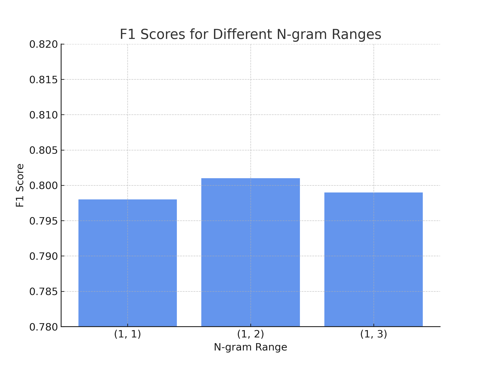
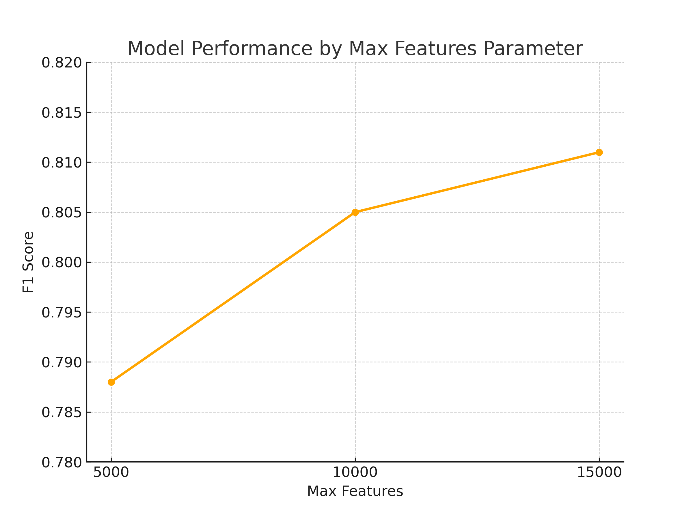
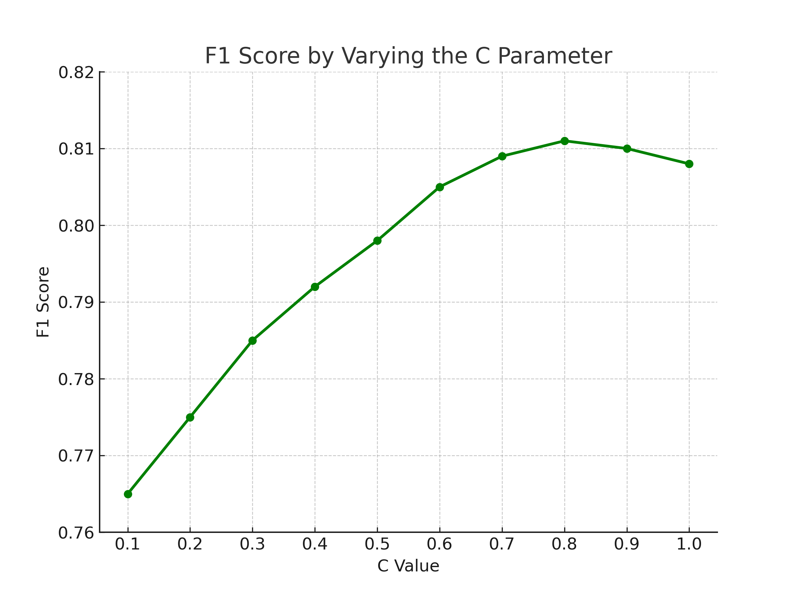

# 📊 Sentiment Analysis on Twitter Data

This repository contains the code, data, and report for a sentiment analysis project. The goal is to classify tweets as either **Positive** or **Negative** using a machine learning model based on textual features.

## 📁 Project Structure

```
Sentiment_Analysis_Predictor/
│
├── data/
│   ├── development.csv        # Training data (with sentiment labels)
│   └── evaluation.csv         # Test data (without sentiment labels)
│
├── notebooks/
│   └── sentiment_analysis.ipynb  # Jupyter Notebook with the full analysis
│
├── src/
│   ├── preprocessing.py        # Text preprocessing and feature extraction
│   ├── train.py                # Model training and hyperparameter tuning
│   └── evaluate.py             # Evaluation and submission file generation
│
├── reports/
│   └── Sentiment_Analysis_Report.pdf  # Final project report
│
├── utils/
│   └── helper_functions.py     # Helper functions for data loading, metrics, etc.
│
├── .gitignore                  # Ignore unnecessary files for version control
├── README.md                   # Project documentation (this file)
└── requirements.txt            # List of required Python packages
```

## 📝 Project Description

This project aims to classify tweets as **Positive** (1) or **Negative** (0) based on their textual content. The main steps include:
- Data Preprocessing (cleaning, tokenization, feature extraction)
- Model Training (hyperparameter tuning and optimization)
- Evaluation (F1 score on test set)

## 📊 Data

The dataset used in this project consists of:
- **development.csv**: Contains tweet text and sentiment labels (Positive = 1, Negative = 0)
- **evaluation.csv**: Contains tweet text without sentiment labels (used for final predictions)

Both datasets include the following features:
- **ids**: Unique tweet ID (not used in the model)
- **date**: Publication date (PDT timezone)
- **flag**: Query used to collect the tweet (always 'NO QUERY', removed during preprocessing)
- **user**: Username of the tweet author (used as a feature)
- **text**: The actual tweet content

## 🚀 Getting Started

### 1. Install Required Packages

Create a virtual environment (optional but recommended) and install the required packages:

```
python -m venv venv
source venv/bin/activate  # On Windows, use venv\Scripts\activate
pip install -r requirements.txt
```

### 2. Preprocess the Data

Prepare the data for training by running the preprocessing script:

```
python src/preprocessing.py
```

### 3. Train the Model

Train the sentiment analysis model with the optimized hyperparameters:

```
python src/train.py
```

### 4. Generate Predictions for Submission

Generate the final submission file for evaluation:

```
python src/evaluate.py
```

## 📈 Model Overview

The final model is a **LinearSVC** classifier, optimized using **RandomizedSearchCV** for hyperparameter tuning. Key features include:
- TF-IDF vectorization for text representation
- One-hot encoding for date features
- Author information as a feature

Hyperparameter tuning results:
- **TF-IDF**: max_df=0.2, min_df=2, ngram_range=(1, 1), max_features=15000
- **LinearSVC**: C=0.336, penalty='l2'

### Hyperparameter Tuning Results

**N-gram Range Tuning**  
The choice of the n-gram range significantly impacts the model's performance. As shown below, unigrams (1,1) provided the best balance between capturing important text features without introducing noise.



**Max Features Tuning**  
Increasing the maximum number of features captured by the TF-IDF vectorizer improved model accuracy, with the best performance at 15,000 features.



**C Parameter Tuning**  
The regularization parameter **C** was fine-tuned to balance model complexity and generalization, resulting in an optimal value of **C = 0.336**.



## 📊 Results

The model achieved an **F1 score** of approximately **0.8110** on the test set, indicating strong predictive performance with balanced precision and recall.

## 👥 Authors

- **Federico Filì** (s332158)  


## 📜 License

© 2025 Federico Filì. All rights reserved.

This project is licensed for personal and educational purposes only. Unauthorized distribution, reproduction, or commercial use is strictly prohibited without prior permission.

## 🛠️ Future Improvements

- Reduce model dependence on specific user data for better generalization
- Experiment with deep learning approaches (e.g., BERT, RoBERTa)

## 📝 References

- [Scikit-learn Documentation](https://scikit-learn.org/stable/index.html)
- [NLTK Documentation](https://www.nltk.org/)

